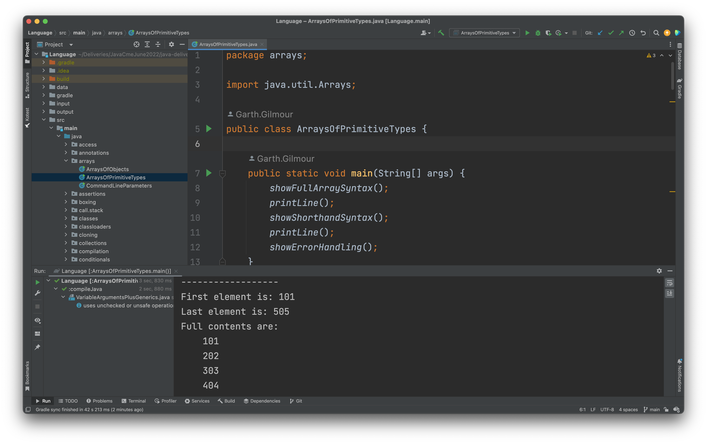

# Welcome and Setup #

Welcome to this June 2022 delivery of the Instil Java course. Your instructor will be Garth Gilmour (garth.gilmour@instil.co). 

Please read through the directions below and contact him if you have any questions. Note that, for issues relating to configuration and security settings, your own admins and mentors are best placed to help.

### What do I need? ###

For this delivery you will need

* The IntelliJ IDE (either the Community or Ultimate edition)
* The Java Development Kit (for Java 11 or above)
* A tool (graphical or command line) for working with GIt repos
* Permissions to run Gradle and Maven build files, and to download the dependencies listed in those build files from external repositories like Maven Central.

### Where are the slides? ###

The slides are stored in [a GDrive folder here](https://drive.google.com/drive/folders/1_90bc6VnKvI4z7tvKKM5RtcVDPhoLUJO?usp=sharing). If you are unable to access this from inside your network don't worry - we will also pass them around on a memory stick during the delivery. 

### How do I get started? ###

Having cloned this repo you have all the examples, exercises and solutions we will be using in the delivery.

Please note these are organised into a number of separate projects. So it is important to open the correct folder, which is always the folder containing the relevant build file. Opening directories that are too high or low will confuse IntelliJ and result in you being unable to build and run the materials.

In advance of the delivery it is only asked that you open the language fundamentals project, and run a couple of the demos. This is to ensure your environment is configured correctly.

In order to do this you:

1. Select `File --> Open` in IntelliJ. Or use the `Open` button on the menu displayed when you have no open projects
2. Navigate to and open the folder `examples\Language`
3. Wait for the project to build via Gradle
4. Novigate to the Java source code in `src/main/java`. This contains a large number of package folders, which in turn contain demos of different aspects of the Java language.
5. Pick some of the demos and run them, as shown in the screenshot below.

### What will the agenda be? ###

The pace of the delivery will very much be driven by your existing experience. We will have a discussion at the start to see how much of the material you are already familiar with (if any).

Assuming everyone is already familiar with the basics, a rough agenda would be:

1. *Monday* - Object Orientation. Principles of good class design. Refactoring and writing maintainable code. Inheritance and Polymorphism. Enumerations, Interfaces and Inner Classes.
2. *Tuesday* - Exceptions. Generics. Test Driven Development. Annotations and Reflection. Performance testing.
3. *Wednesday* - Effective use of Collections. Lambdas and Method References. Functional programming and the Streams API. Property Based Testing. Tailoring Garbage Collection.